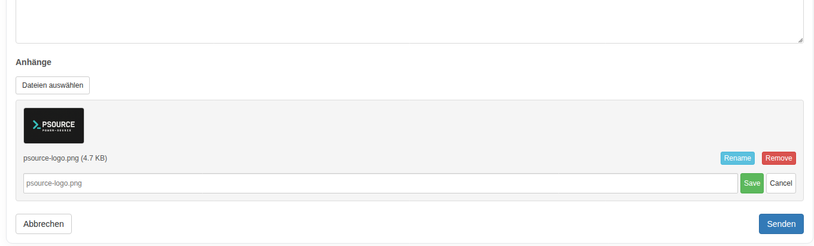

<h2 align="center" style="color:#38c2bb;">PS PM System</h2>

  <a href="https://github.com/Power-Source/private-messaging/releases" style="color:#38c2bb;">Download</a>
  <a href="https://power-source.github.io/ps-update-manager/" style="color:#38c2bb;">PSOURCE MANAGER</a>

## Egal, ob Du ein vielbesuchtes Forum mit Hunderten von Nutzern betreibst oder einfach nur Webseiten-Betreiber in Deinem Multisite-Netzwerk vernetzen möchtest, das PSOURCE PM System hilft Dir dabei, eine engagiertere und freundlichere Community aufzubauen.

 Verbessere die Reaktionszeiten mit auffälligen Pop-up-Benachrichtigungen.

### Front-End-Messaging

Dein Posteingang ist für Dich und Deine Nutzer von überall auf Deiner Webseite zugänglich. Klicke einfach auf das E-Mail-Symbol in der Admin-Toolbar. Neue Nachrichten lassen sich blitzschnell und von überall auf Deiner Webseite aus versenden. Ob Du gerade an einem neuen Blogbeitrag arbeitest oder Dein Theme anpasst – Du kannst eine neue Nachricht verfassen, ohne Deinen Arbeitsablauf zu unterbrechen. Das Feld „Senden an“ übernimmt Benutzernamen von Deiner gesamten Webseite und vervollständigt diese automatisch, sodass man sich keine E-Mail-Adressen mehr merken muss. 

 Anhänge in privaten Nachrichten erleichtern das Teilen von Dateien.

### Privater Dateiaustausch

Teile Fotos und Screenshots privat mit anderen Nutzern oder beschränke die Berechtigung zum Teilen von Bildern je nach Nutzerrolle. Mit aktiviertem PS Bloghosting kannst Du die Dateifreigabe sogar als exklusive Funktion für zahlende Mitglieder anbieten.

### Einfache Einrichtung

Die Einrichtung von Private Messaging ist kinderleicht. Einfach das Plugin installieren und aktivieren. Private Messaging ist sofort einsatzbereit, sodass Du dich nicht mit Einstellungen herumschlagen musst. Es gibt sogar eine Option, automatisch Posteingangsseiten für Deine Nutzer zu erstellen.  

### Getting Started

Once installed and activated, you'll see a new menu item in your dashboard: Messaging.

We'll need to assign a page for Private Messaging to use as the Inbox page, so let's head over to: Messaging -> Settings Once there, you'll see the "Inbox Page" section on the page:

You can assign an existing page to use by clicking on the drop-down menu and selecting a page, but for the purposes of this tutorial, we'll just create a new page. Click on "Create Page", and that'll create a page for Private Messaging to use as the Inbox page. Once you've done that, click on Save Changes at the bottom of this page, and we'll head off to the new Inbox page. :)

### Using your Inbox

You might have noticed a mail icon on the admin bar above. Hover over that, and click on "View Inbox":

You'll then be taken to the Inbox page, which has an interface similar to a basic email client:

You can start composing a message to another user by clicking on the "Compose" button on the page:

You can also do this by hovering over the mail icon on the admin bar, and clicking on "Send New Message". For any messages that you wish to move out of the Inbox, and be saved for later, you can click on the archive button:

They'll be stored in the Archives tab, from which you can also choose to either move the message back into the Inbox, or delete forever:

We'll touch on the Settings tab inside the Inbox in a moment, but first, let's head back over to the General Settings page.

### Configuring the Settings

##### General Settings

Above the "Create Page" section (which we've already touched on), you'll notice two options there:

The _Enable Message Receipt_ option allows a user to be notified when his message has been seen by another user. The companion feature, _Allow the user to disable read message receipts?_, allows a user to choose whether or not his reading of a message from another user sends a notification to the sender. Both of these boxes are checked by default inside Private Messaging, and can be configured by the user inside the Settings tab for the Inbox:

Moving down the General Settings page here brings us to the Add-ons section:

The _BBPress integration_ grants the ability to message a user from within a bbPress thread, by means of a "Message Me" button:

The _Block List_ add-on allows users to block messages from one or more users, a field is added to the Settings tab inside the Inbox page:

The _Capability_ add-on allows you to restrict the sending of messages on your site to specific user roles. Once this add-on is activated, you can configure it further from: Messaging -> Settings -> Capability Settings

The _Notification_ add-on allows users to be notified of new messages sent to them:

Note: This add-on (as noted on the settings page) is in BETA, so there may be certain aspects that aren't quite right yet. The _WYISWYG_ add-on converts the default text editor into a more feature filled text editor, allow more styling to be added to your messsages:

##### Email Settings

Here, you can adjust the subject lines & message content for email notifications, for when messages are received (as well as notifications that a user has read your message).

You can also adjust the amount of emails to be displayed per page on the Inbox page by adjusting the value for "Per Page".

##### Shortcodes

Here, you can see the available shortcodes for Private Messaging, as well as the parameters available:

##### Attachments

Here, you can configure which user roles can add attachments to messages being sent:

